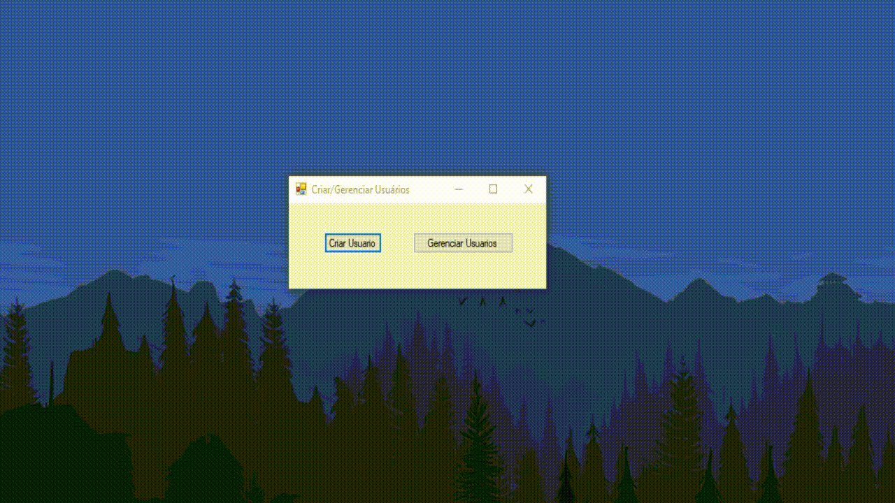
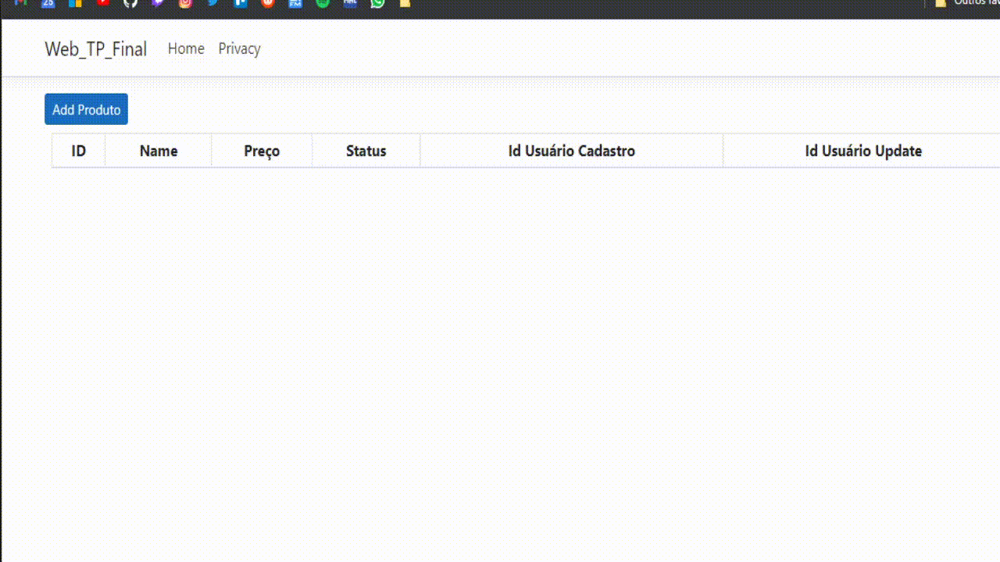

# Trabalho Prático Final
## Autores: Sandyara Peres e Bruno Fernandes
Trabalho realizado para a disciplina de Sistemas Web 2 (ASP.NET MVC), ministrada por Wellington Tuller Moraes no Instituto Federal de São Paulo, campus Cubatão.  

### Captura de tela da aplicação
#### Desktop

#### Web

# Pacotes utilizados

**API**
- Microsoft.AspNetCore.Mvc.NewtonsoftJson (versão 3.0.0)
- Microsoft.EntityFrameworkCore.SqServer
- Microsoft.EntityFrameworkCore.Tools

**Desktop**
- Microsoft.AspNet.WebApi.Client
- Newstonsoft.Json

# Pré-requisitos e como rodar a aplicação

Requisitos:

Visual Studio 2019 qualquer versão.

Como rodar:

Crie o Banco com o "Update-Database" no Console do Gerenciador de Pacotes
Agora compile o projeto.